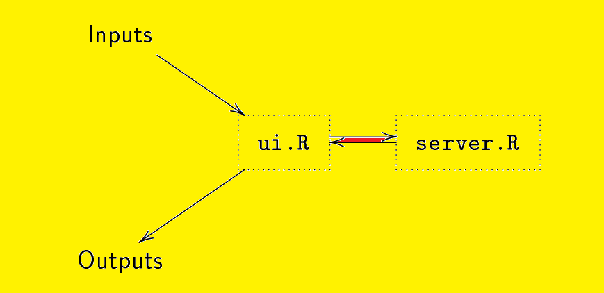
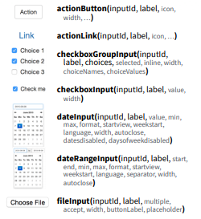
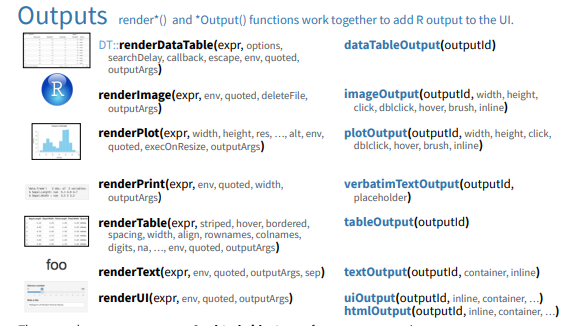
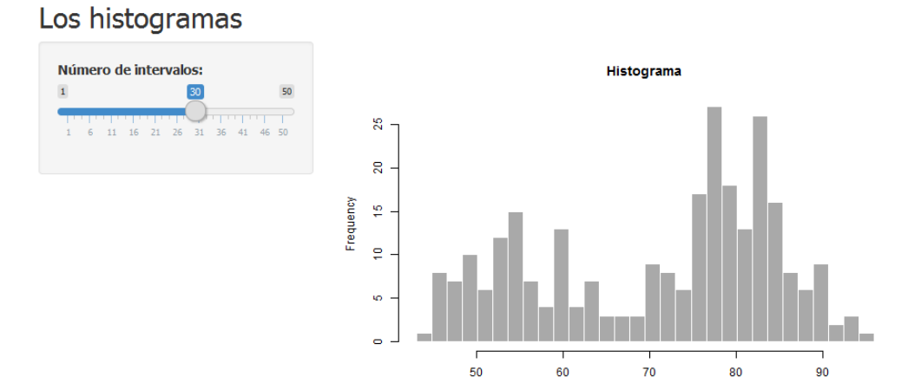
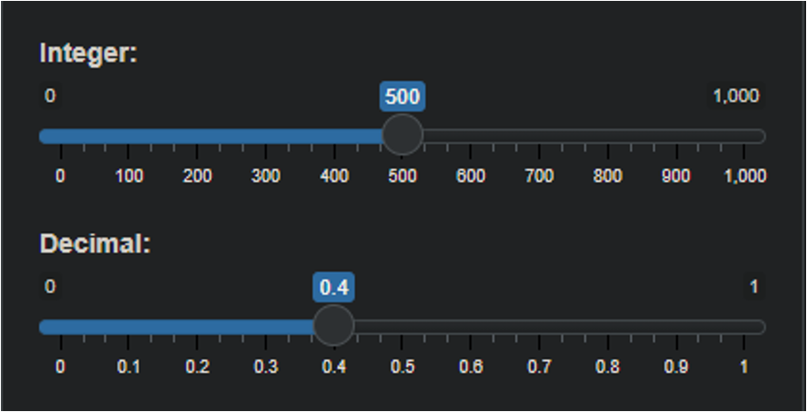
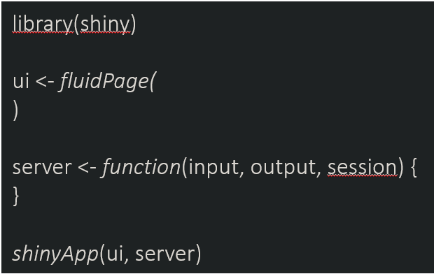
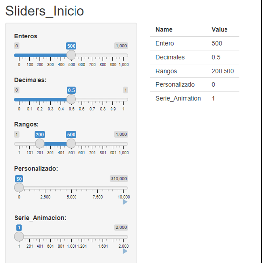

class: inverse
# ¿QUÉ ES SHINY?


###Shiny es un paquete R que facilita la creación de aplicaciones web interactivas,  directamente desde R.  Shiny le permite tomar su trabajo en R y exponerlo a través de un navegador web para que cualquiera pueda usarlo.
En pocas palabras Shiny es un paquete de R que permite construir aplicaciones web interactivas a partir de los scripts de R.

###INSTALACIÓN:
```{R=V}
install.packages (" shiny " )
library (" shiny ")


```

---
###EJEMPLOS DE APLICACIONES:

```{R=V}
runExample ( " 01_ hello ") # un histograma
runExample ( " 02_ text ") # tablas y dataframes
runExample ( " 03_ reactivity ") # una expresi ón reactiva
runExample ( " 04_ mpg ") # variables globales
runExample ( " 05_ sliders ") # barras deslizables
runExample ( " 06_ tabsets ") # varias pesta ñas
runExample ( " 07_ widgets ") # textos de ayuda y botones
runExample ( " 08_ html ") # Shiny desde HTML
runExample ( " 09_ upload " ) # carga de archivos
runExample ( " 10_ download ") # descarga de archivos
runExample ( " 11_ timer ") # día y hora
``` 
---
class: inverse
##CREANDO UN SHINY
File Create project from: <br/> Project Type:<br/>
New project .<br/> New directory .<br/> Shiny Web Application <br/>
El resultado es un directorio nuevo con el nombre que hayamos elegido en el que
aparecen dos archivos (ui.R y server.R).


<UL type=square>
Una app de shiny consta (al menos) de dos archivos:<br/><br/><br/>
<LI>un script para la interfaz del usuario, (user-interface, ui.R), &nbsp; que recibe los inputs y
muestra los outputs, y<br/><br/><br/>
<LI>un script para los cálculos (server.R), que realiza los cálculos necesarios.<br/><br/><br/>



---
class: inverse
##INPUT
.pull.left[
]
.pull.right[
]
---
##OUTPUTS



---
##UN PRIMER EJEMPLO
###LOS HISTOGRAMAS:



---
class: inverse

INPUTS (Elementos de ingreso)

Siguiendo con la línea de interacción de Shiny, tenemos:

Sliders

Esta herramienta permite obtener entradas del control deslizante, las que se pueden usar para seleccionar valores individuales, para seleccionar un rango continuo de valores e incluso para animar sobre un rango. 


Se puede configurar de la siguiente forma:

SliderInput(inputId, label, min, max,
	   value, step, round, format, locale, ticks,
	  animate, width, sep, pre, post,
	  timeFormat, timezone, dragRange)




---


##Sliders

A partir de los modelos predeterminados podemos crear nuestras propias visualizaciones web.

Una forma sencilla de acceder a Slider es con:

runExample(“05_sliders”) 		 # slider bars

Pero para entender como funciona iremos desde cero.

Analicemos lo que sucede…

Define la interfaz de usuario.

Especifica el comportamiento de nuestra aplicación definiendo una 
serverfunción. En la imagen se aprecia vacío.

Se ejecuta shinyApp(ui, server)para construir e iniciar una aplicación
Shiny desde la interfaz de usuario y el servidor.



---
Trabajando en el input:

```{R=V}
ui <- fluidPage(
  titlePanel("Sliders_Inicio"),
  sidebarLayout(
    sidebarPanel(
      sliderInput("integer", “Enteros:",
                  min = 0, max = 1000,
                  value = 500),
      sliderInput("decimal", "Decimales:",
                  min = 0, max = 1,
                  value = 0.5, step = 0.1)
      sliderInput("range", "Rangos:",
                  min = 1, max = 1000,
                  value = c(200,500)),
      sliderInput("format", “Personalizado:",
                  min = 0, max = 10000,
                  value = 0, step = 2500,
                  pre = "$", sep = ",",
                  animate = TRUE),
      sliderInput("animation", “Serie_Animacion:",
                  min = 1, max = 2000,
                  value = 1, step = 10,
                  animate =
                    animationOptions(interval = 300, loop = TRUE)) 
    ),
    mainPanel(
      tableOutput("values")   
    )
  )
)
```
---
##Que se observa?
<UL type=square>

###<LI>Agregado del titulo “Sliders_Inicio” para el panel.
 
###<LI>SiderbarLayout para la vista.


###<LI>SiderbarPanel crea multiples widget

###<LI> Ingresa los barras interactivas. Escogiendo para los ejemplos
       #Enteros, #Decimales, #Rangos, #Personalizado y #Aninacion.

###<LI>mainPanel: Crea una tabla con los valores de salida fijados por las barras de desplazamiento creada.

###<LI>tableOutput: Resume la tabla de valores de salida.
---
class: inverse
```{R=V}
Trabajando en el server:
server <- function(input, output) {
  sliderValues <- reactive({
    data.frame(
      Name = c(“E
ntero",
               "Decimales",
               "Rangos",
               “Personalizado",
               “Serie_Animation"),
      Value = as.character(c(input$integer,
                             input$decimal,
                             paste(input$range, collapse = " "),
                             input$format,
                             input$animation)),
      stringsAsFactors = FALSE)
    
  })
  output$values <- renderTable({
    sliderValues()
  })
  
}
shinyApp(ui, server)

```
---
class: inverse
#Que se observa?
<UL type=square>

###<LI>Reactive: Crea una expresión para fijar un marco de datos de todos los valores de entrada.
 
###<LI>Se crea un data frame con las etiquetas para los valores de entrada.

###<LI>Se indica los valores de salida $, mostrados en una tabla.

###<LI> Crea Shiny app.


---
class: inverse


---
##Usar scripts y datos de R
```{R=V}
library(mapproj)
source("helpers.R")
counties <- readRDS("data/counties.rds")
percent_map(counties$white, "darkgreen", "% White")

ui <- fluidPage(
  titlePanel("censo de EE.UU. en el 2010"),
  
  sidebarLayout(
    sidebarPanel(
      helpText("Create demographic maps with 
        information from the 2010 US Census."),
      
      selectInput("var", 
                  label = "Choose a variable to display",
                  choices = c("Percent White", "Percent Black",
                              "Percent Hispanic", "Percent Asian"),
                  selected = "Percent White"),
      
      sliderInput("range", 
                  label = "Range of interest:",
                  min = 0, max = 100, value = c(0, 100))
    ),
    
    mainPanel(plotOutput("map"))
  )
)

# Server logic ----
server <- function(input, output) {
  output$map <- renderPlot({
    data <- switch(input$var, 
                   "Percent White" = counties$white,
                   "Percent Black" = counties$black,
                   "Percent Hispanic" = counties$hispanic,
                   "Percent Asian" = counties$asian)
    
    color <- switch(input$var, 
                    "Percent White" = "darkgreen",
                    "Percent Black" = "black",
                    "Percent Hispanic" = "darkorange",
                    "Percent Asian" = "darkviolet")
    
    legend <- switch(input$var, 
                     "Percent White" = "% White",
                     "Percent Black" = "% Black",
                     "Percent Hispanic" = "% Hispanic",
                     "Percent Asian" = "% Asian")
    
    percent_map(data, color, legend, input$range[1], input$range[2])
  })
}

# Run app ----
shinyApp(ui, server)
```
---
